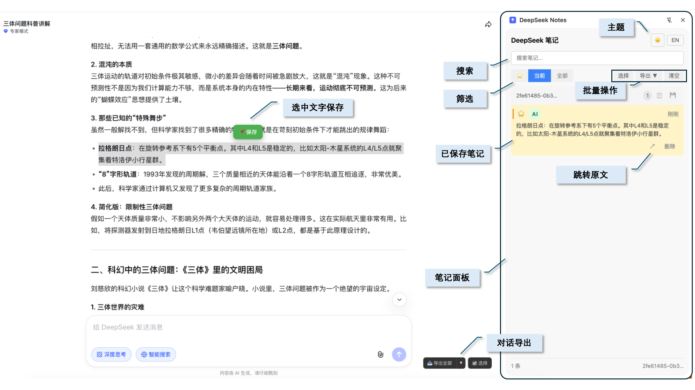

<div align="center">

# 📌 DS Note

**DeepSeek 对话增强插件**

[](LICENSE)
[](https://github.com/chenxiachan/ds-note)
[](https://github.com/chenxiachan/ds-note/stargazers)

[English](README_EN.md) · [中文](README.md)

*DS Note is not affiliated with DeepSeek. DeepSeek is a trademark of DeepSeek.*

</div>

---



## 👋 为什么需要 DS Note？

在与 DeepSeek 进行长对话时，你可能想要**摘取重要片段**、**高亮关键内容**，或者**导出整个对话**备份。DS Note 让你可以随手保存、快速检索，并一键跳转回原始上下文。

## ✨ 功能

| | 功能 | 描述 |
|---|------|------|
| 📌 | **保存消息** | 收藏整条消息或选中文字保存 |
| 📋 | **侧边栏** | 在侧边栏中查看和管理所有笔记 |
| ↗️ | **跳转原文** | 一键跳转回原始消息 |
| 🕐 | **时间轴导航** | 长对话中精准定位 |
| 🔍 | **搜索过滤** | 搜索笔记，按对话或收藏筛选 |
| ⭐ | **收藏笔记** | 标记重要笔记以便快速访问 |
| 📤 | **导出** | Markdown 或 JSONL 格式 |
| 🌓 | **主题** | 深色 / 浅色模式 |
| 🌐 | **双语** | 中英文界面 |

## 📦 安装

<div align="center">

[](https://github.com/chenxiachan/deepseek-notes/archive/refs/heads/main.zip)

</div>

1. 下载并解压仓库
2. 打开 Chrome → `chrome://extensions`
3. 启用右上角的**开发者模式**
4. 点击**加载已解压的扩展程序**
5. 选择 `deepseek-notes` 文件夹

## 🚀 使用方法

1. 访问 [chat.deepseek.com](https://chat.deepseek.com)
2. **保存整条消息**：点击消息右下角的 📌 按钮
3. **保存选中文字**：选中高亮文字 → 点击弹出的保存按钮
4. 点击扩展图标打开笔记面板
5. 点击笔记上的 ↗️ 跳转回原始消息

## 🔒 隐私

- ✅ 所有数据存储在本地浏览器中
- ✅ 无外部服务器
- ✅ 不收集任何数据
- ✅ 仅在 chat.deepseek.com 上工作

## 📁 项目结构

```
deepseek-notes/
├── manifest.json        # 扩展配置
├── background.js        # Service Worker
├── content-script.js    # 保存和跳转逻辑
├── sidepanel/           # 笔记面板 UI
└── styles/              # 注入样式
```

## 📄 许可证

[MIT](LICENSE) © 2026

---

<div align="center">

**如果觉得有用，请给个 ⭐ Star！**

</div>
