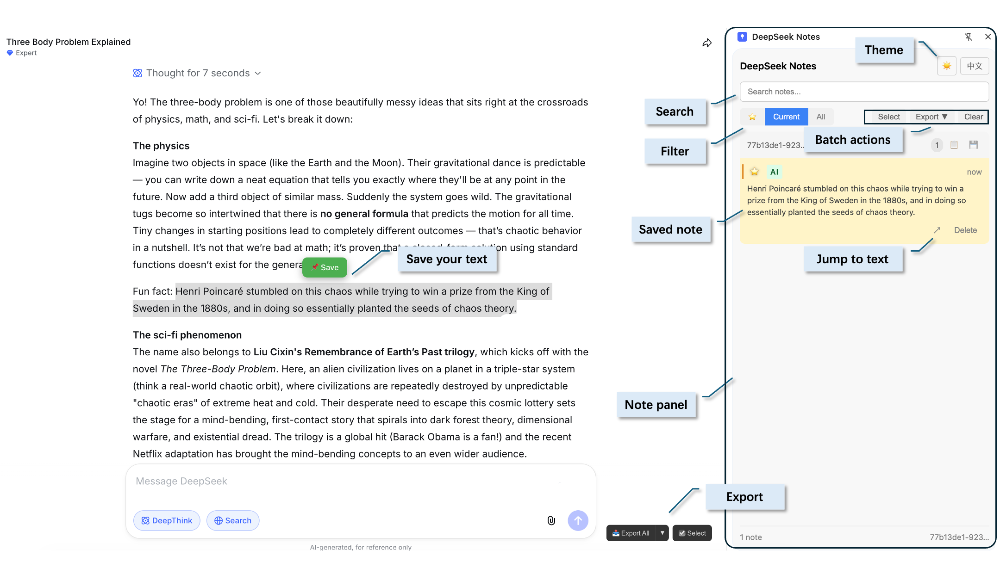

<div align="center">

# 📌 DeepSeek Notes

**Save, organize, and navigate your DeepSeek conversations**

[](LICENSE)
[](https://github.com/chenxiachan/deepseek-notes)
[](https://github.com/chenxiachan/deepseek-notes/stargazers)

[English](README_EN.md) · [中文](README.md)

</div>

---



## 👋 Why DeepSeek Notes?

When having long conversations with DeepSeek, you may want to **extract key snippets**, **highlight important content**, or **export the entire conversation** for backup. DeepSeek Notes lets you save on the fly, search quickly, and jump back to the original context with one click.

## ✨ Features

| | Feature | Description |
|---|---------|-------------|
| 📌 | **Save Messages** | Pin entire messages or highlight text to save |
| 📋 | **Side Panel** | View and manage all notes in a sidebar |
| ↗️ | **Jump to Original** | Navigate back to the original message instantly |
| 🕐 | **Timeline Navigation** | Precise jumping in long conversations |
| 🔍 | **Search & Filter** | Search notes, filter by conversation or starred |
| ⭐ | **Star Notes** | Mark important notes for quick access |
| 📤 | **Export** | Markdown or JSONL format |
| 🌓 | **Theme** | Dark / Light mode |
| 🌐 | **Bilingual** | English & Chinese interface |

## 📦 Installation

<div align="center">

[](https://github.com/chenxiachan/deepseek-notes/archive/refs/heads/main.zip)

</div>

1. Download and unzip the repository
2. Open Chrome → `chrome://extensions`
3. Enable **Developer mode** (top right toggle)
4. Click **Load unpacked**
5. Select the `deepseek-notes` folder

## 🚀 Usage

1. Go to [chat.deepseek.com](https://chat.deepseek.com)
2. **Save entire message**: Click the 📌 button at the bottom-right of any message
3. **Save selected text**: Highlight text → click the save button that appears
4. Click the extension icon to open the notes panel
5. Click ↗️ on any note to jump back to the original message

## 🔒 Privacy

- ✅ All data stored locally in your browser
- ✅ No external servers
- ✅ No data collection
- ✅ Works only on chat.deepseek.com

## 📁 Project Structure

```
deepseek-notes/
├── manifest.json        # Extension config
├── background.js        # Service worker
├── content-script.js    # Save & jump logic
├── sidepanel/           # Notes panel UI
└── styles/              # Injected styles
```

## 📄 License

[MIT](LICENSE) © 2026

---

<div align="center">

**If you find this useful, please ⭐ star the repo!**

</div>
